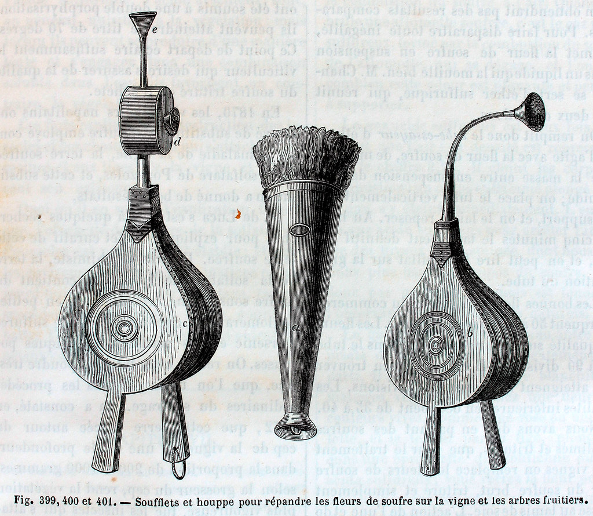

# LibraryUtils
📚 Library Utils 📚

## What it contains
- Util functions
- Util services (e.g.: `git/`)
- Mocks for different libraries and some of Golang's internal libraries
- Scripts in `.script/` that are just simple tools to help with development (they do require some level of handholding)

> [!NOTE]
> This repository is here unify common code, and to make it easier to quickly implement mocks for common Golang libraries
> and other external libraries used.

## ©️ Copyright
- "<a rel="noopener noreferrer" href="https://www.flickr.com/photos/37667416@N04/4623428635">&#039;Soufflets et houppe pur répandre les fleurs de soufre sur la vigne et les arbres fruitiers&#039;</a>" by <a rel="noopener noreferrer" href="https://www.flickr.com/photos/37667416@N04">Biblioteca Rector Machado y Nuñez</a> is marked with <a rel="noopener noreferrer" href="https://creativecommons.org/publicdomain/mark/1.0/?ref=openverse">Public Domain Mark 1.0 </a>.

## :scroll: License

The license for the code and documentation can be found in the [LICENSE](./LICENSE) file.

---

Made in Québec 🏴󠁣󠁡󠁱󠁣󠁿, Canada 🇨🇦!
